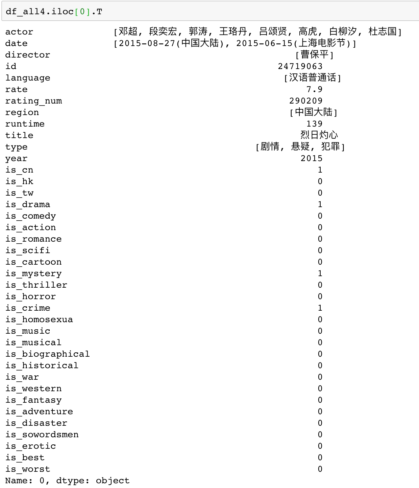

## 数据列说明

- actor: 主演

- director: 导演

- date: 上映日期

- id: 豆瓣id

- language: 语言

- rate: 评分

- rating_num: 参与评分人数

- region: 制片地区

- runtime: 片长

- title: 电影名称

- type: 类型

- year: 上映年份

- is_cn: 是否属于大陆地区

- is_hk: 是否属于香港地区

- is_tw: 是否属于台湾地区

- is_drama: 是否属于剧情片

- is_comedy: 是否属于喜剧片

- is_action: 是否属于动作片

- is_romance: 是否属于爱情片

- is_scifi: 是否属于科幻片

- is_cartoon: 是否属于动画片

- is_mystery: 是否属于悬疑片

- is_thriller: 是否属于惊悚片

- is_horror: 是否属于恐怖片

- is_crime: 是否属于犯罪片

- is_homosexua: 是否属于同性片

- is_music: 是否属于音乐片

- is_musical: 是否属于歌舞片

- is_biographical: 是否属于传记片

- is_historical: 是否属于历史片

- is_war: 是否属于战争片

- is_western: 是否属于西部片

- is_fantasy: 是否属于奇幻片

- is_adventure: 是否属于冒险

- is_disaster: 是否属于灾难片

- is_sowordsmen: 是否属于武侠片

- is_erotic: 是否属于情色片

- is_best: 是否评分大于等于8.5分

- is_worst: 是否评分小于6分

